## Font Table

A list of all icons included as well as their Unicode code points.

### CPU

| `0xf000` | `0xf001` | `0xf002` | `0xf003` | `0xf004` | `0xf005` | `0xf006` | `0xf007` |
| :---: | :---: | :---: | :---: | :---: | :---: | :---: | :---: |
|  |  |  |  |  |  |  |  |

| `0xf008` | `0xf009` | `0xf00a` |
| :---: | :---: | :---: |
|  |  | 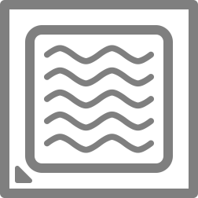 |

### CPU Cores

| `0xf100` | `0xf101` | `0xf102` | `0xf103` | `0xf104` | `0xf105` | `0xf106` | `0xf107` |
| :---: | :---: | :---: | :---: | :---: | :---: | :---: | :---: |
| 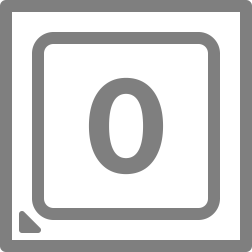 |  |  |  |  |  |  |  |

| `0xf108` | `0xf109` | `0xf10a` | `0xf10b` | `0xf10c` | `0xf10d` | `0xf10e` | `0xf10f` |
| :---: | :---: | :---: | :---: | :---: | :---: | :---: | :---: |
|  |  |  |  |  |  |  |  |

| `0xf110` | `0xf111` | `0xf112` | `0xf113` | `0xf114` | `0xf115` | `0xf116` | `0xf117` |
| :---: | :---: | :---: | :---: | :---: | :---: | :---: | :---: |
|  |  |  |  |  |  |  |  |

| `0xf118` | `0xf119` | `0xf11a` | `0xf11b` | `0xf11c` | `0xf11d` | `0xf11e` | `0xf11f` |
| :---: | :---: | :---: | :---: | :---: | :---: | :---: | :---: |
|  |  |  |  |  |  |  |  |

| `0xf120` |
| :---: |
|  |

### GPU

| `0xf010` | `0xf011` | `0xf012` | `0xf013` | `0xf014` | `0xf015` | `0xf016` | `0xf017` |
| :---: | :---: | :---: | :---: | :---: | :---: | :---: | :---: |
| 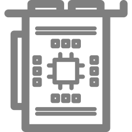 |  |  |  |  |  |  | 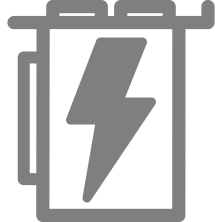 |

| `0xf018` | `0xf019` | `0xf01a` | `0xf01b` | `0xf01c` |
| :---: | :---: | :---: | :---: | :---: |
| 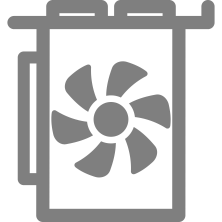 |  |  |  |  |

### Motherboard

| `0xf020` | `0xf021` | `0xf022` | `0xf023` | `0xf024` | `0xf025` | `0xf026` | `0xf027` |
| :---: | :---: | :---: | :---: | :---: | :---: | :---: | :---: |
|  |  | 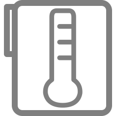 |  |  |  |  |  |

| `0xf028` | `0xf029` | `0xf02a` | `0xf02b` |
| :---: | :---: | :---: | :---: |
|  | 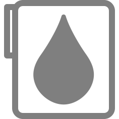 |  |  |

### RAM

| `0xf030` | `0xf031` | `0xf032` | `0xf033` | `0xf034` | `0xf035` | `0xf036` | `0xf037` |
| :---: | :---: | :---: | :---: | :---: | :---: | :---: | :---: |
| 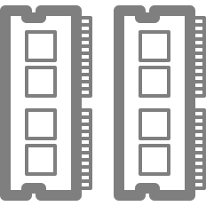 | 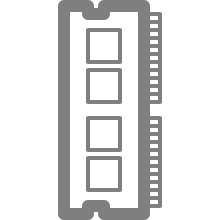 |  | 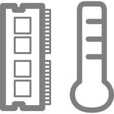 | 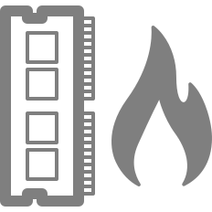 |  |  | 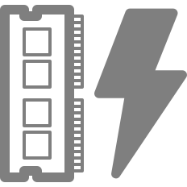 |

| `0xf038` | `0xf039` | `0xf03a` | `0xf03b` | `0xf03c` |
| :---: | :---: | :---: | :---: | :---: |
| 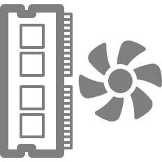 |  |  |  |  |

### Drives

| `0xf080` | `0xf081` | `0xf082` | `0xf083` | `0xf084` | `0xf085` | `0xf086` | `0xf087` |
| :---: | :---: | :---: | :---: | :---: | :---: | :---: | :---: |
|  |  |  |  |  |  |  |  |

| `0xf088` | `0xf089` | `0xf08a` |
| :---: | :---: | :---: |
|  |  |  |

### Drive Letters

| `0xf090` | `0xf091` | `0xf092` | `0xf093` | `0xf094` | `0xf095` | `0xf096` | `0xf097` |
| :---: | :---: | :---: | :---: | :---: | :---: | :---: | :---: |
|  |  |  |  |  |  |  |  |

| `0xf098` | `0xf099` | `0xf09a` | `0xf09b` | `0xf09c` | `0xf09d` | `0xf09e` | `0xf09f` |
| :---: | :---: | :---: | :---: | :---: | :---: | :---: | :---: |
|  |  |  |  |  |  |  |  |

| `0xf0a0` | `0xf0a1` | `0xf0a2` | `0xf0a3` | `0xf0a4` | `0xf0a5` | `0xf0a6` | `0xf0a7` |
| :---: | :---: | :---: | :---: | :---: | :---: | :---: | :---: |
|  |  |  |  |  |  |  |  |

| `0xf0a8` | `0xf0a9` |
| :---: | :---: |
|  |  |

### Recycling Bin

| `0xf0b0` | `0xf0b1` |
| :---: | :---: |
|  |  |

### Fan

| `0xf040` | `0xf041` |
| :---: | :---: |
|  |  |

### Water Pump

| `0xf048` |
| :---: |
|  |

### Networking

| `0xf050` | `0xf051` | `0xf052` | `0xf053` | `0xf054` | `0xf055` | `0xf056` | `0xf057` |
| :---: | :---: | :---: | :---: | :---: | :---: | :---: | :---: |
|  | 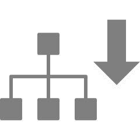 | 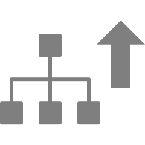 |  | 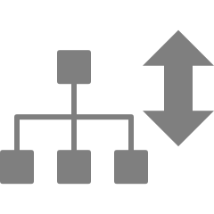 |  | 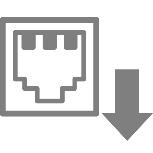 |  |

| `0xf058` | `0xf059` | `0xf05a` | `0xf05b` | `0xf05c` | `0xf05d` | `0xf05e` |
| :---: | :---: | :---: | :---: | :---: | :---: | :---: |
|  |  |  |  |  |  |  |

### Statistics

| `0xf070` | `0xf071` | `0xf072` | `0xf073` | `0xf074` | `0xf075` | `0xf076` | `0xf077` |
| :---: | :---: | :---: | :---: | :---: | :---: | :---: | :---: |
| 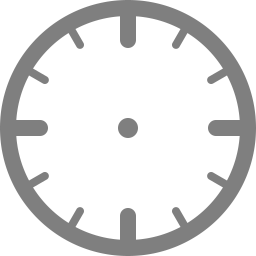 |  |  |  |  |  | 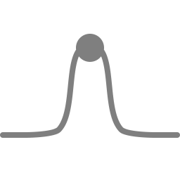 | 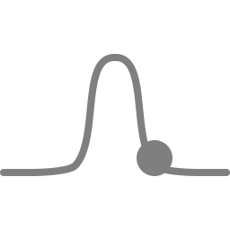 |

| `0xf078` |
| :---: |
| 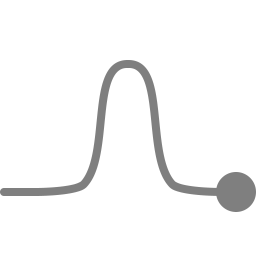 |

### Time

| `0xf0d0` | `0xf0d1` | `0xf0d2` | `0xf0d3` | `0xf0d4` | `0xf0d5` | `0xf0d6` | `0xf0d7` |
| :---: | :---: | :---: | :---: | :---: | :---: | :---: | :---: |
|  |  | 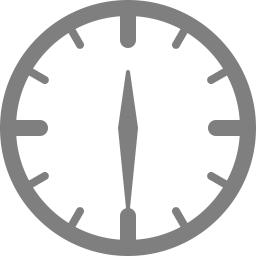 |  |  |  |  |  |

| `0xf0d8` | `0xf0d9` | `0xf0da` | `0xf0db` | `0xf0dc` | `0xf0dd` | `0xf0de` | `0xf0df` |
| :---: | :---: | :---: | :---: | :---: | :---: | :---: | :---: |
|  |  |  |  |  | 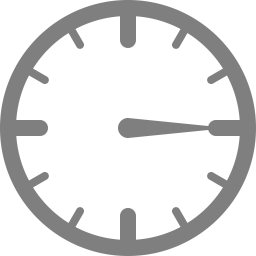 |  | 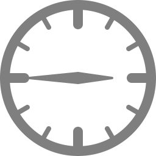 |

| `0xf0e0` | `0xf0e1` | `0xf0e2` | `0xf0e3` | `0xf0e4` | `0xf0e5` | `0xf0e6` | `0xf0e7` |
| :---: | :---: | :---: | :---: | :---: | :---: | :---: | :---: |
|  |  |  | 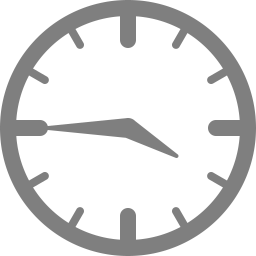 |  |  |  |  |

| `0xf0e8` | `0xf0e9` | `0xf0ea` | `0xf0eb` | `0xf0ec` | `0xf0ed` | `0xf0ee` | `0xf0ef` |
| :---: | :---: | :---: | :---: | :---: | :---: | :---: | :---: |
| 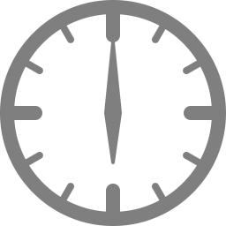 |  | 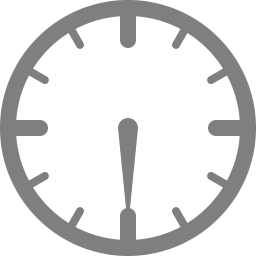 |  |  |  |  |  |

| `0xf0f0` | `0xf0f1` | `0xf0f2` | `0xf0f3` | `0xf0f4` | `0xf0f5` | `0xf0f6` | `0xf0f7` |
| :---: | :---: | :---: | :---: | :---: | :---: | :---: | :---: |
|  |  |  |  |  |  |  |  |

| `0xf0f8` | `0xf0f9` | `0xf0fa` | `0xf0fb` | `0xf0fc` | `0xf0fd` | `0xf0fe` | `0xf0ff` |
| :---: | :---: | :---: | :---: | :---: | :---: | :---: | :---: |
|  |  |  |  |  |  |  |  |

### Miscellaneous

| `0xf060` | `0xf061` | `0xf062` | `0xf063` | `0xf064` | `0xf065` | `0xf066` | `0xf067` |
| :---: | :---: | :---: | :---: | :---: | :---: | :---: | :---: |
|  |  |  | 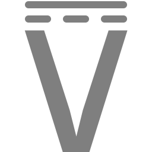 |  |  |  |  |

| `0xf068` | `0xf069` | `0xf06a` |
| :---: | :---: | :---: |
|  |  |  |

