## Font Table

A list of all icons included as well as the Unicode code point assigned to them in the font files included in the releases.

### CPU (./icons/cpu/)

| `U+F000` | `U+F001` | `U+F002` | `U+F003` | `U+F004` | `U+F005` | `U+F006` | `U+F007` |
| :---: | :---: | :---: | :---: | :---: | :---: | :---: | :---: |
|  |  |  |  |  |  | 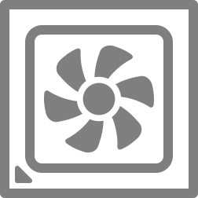 |  |

| `U+F008` | `U+F009` | `U+F00A` |
| :---: | :---: | :---: |
|  |  |  |

### CPU Cores (./icons/cpu/cores/)

| `U+F100` | `U+F101` | `U+F102` | `U+F103` | `U+F104` | `U+F105` | `U+F106` | `U+F107` |
| :---: | :---: | :---: | :---: | :---: | :---: | :---: | :---: |
|  |  |  |  |  |  |  |  |

| `U+F108` | `U+F109` | `U+F10A` | `U+F10B` | `U+F10C` | `U+F10D` | `U+F10E` | `U+F10F` |
| :---: | :---: | :---: | :---: | :---: | :---: | :---: | :---: |
|  |  |  |  |  |  |  |  |

| `U+F110` | `U+F111` | `U+F112` | `U+F113` | `U+F114` | `U+F115` | `U+F116` | `U+F117` |
| :---: | :---: | :---: | :---: | :---: | :---: | :---: | :---: |
|  |  |  |  |  |  |  |  |

| `U+F118` | `U+F119` | `U+F11A` | `U+F11B` | `U+F11C` | `U+F11D` | `U+F11E` | `U+F11F` |
| :---: | :---: | :---: | :---: | :---: | :---: | :---: | :---: |
|  |  |  |  |  |  | 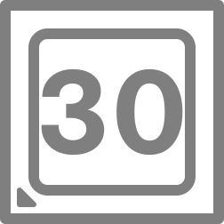 | 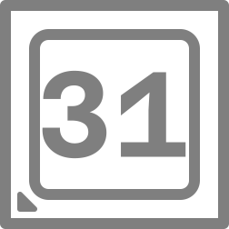 |

| `U+F120` |
| :---: |
|  |

### GPU (./icons/gpu/)

| `U+F010` | `U+F011` | `U+F012` | `U+F013` | `U+F014` | `U+F015` | `U+F016` | `U+F017` |
| :---: | :---: | :---: | :---: | :---: | :---: | :---: | :---: |
|  |  |  | 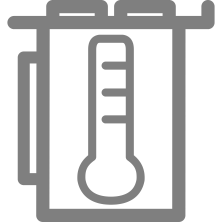 | 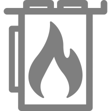 |  |  |  |

| `U+F018` | `U+F019` | `U+F01A` | `U+F01B` | `U+F01C` |
| :---: | :---: | :---: | :---: | :---: |
|  | 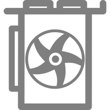 | 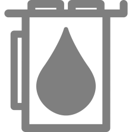 | 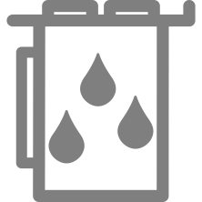 | 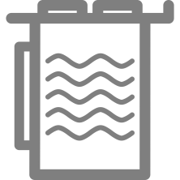 |

### Motherboard (./icons/motherboard/)

| `U+F020` | `U+F021` | `U+F022` | `U+F023` | `U+F024` | `U+F025` | `U+F026` | `U+F027` |
| :---: | :---: | :---: | :---: | :---: | :---: | :---: | :---: |
|  | 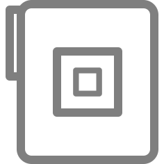 |  |  |  |  |  |  |

| `U+F028` | `U+F029` | `U+F02A` | `U+F02B` |
| :---: | :---: | :---: | :---: |
|  |  |  |  |

### RAM (./icons/ram/)

| `U+F030` | `U+F031` | `U+F032` | `U+F033` | `U+F034` | `U+F035` | `U+F036` | `U+F037` |
| :---: | :---: | :---: | :---: | :---: | :---: | :---: | :---: |
|  |  |  |  |  |  |  |  |

| `U+F038` | `U+F039` | `U+F03A` | `U+F03B` | `U+F03C` |
| :---: | :---: | :---: | :---: | :---: |
|  |  |  |  | 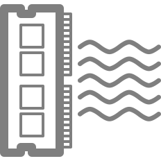 |

### Logical Drives (./icons/drives/logical/)

| `U+F080` | `U+F081` | `U+F082` | `U+F083` | `U+F084` | `U+F085` | `U+F086` | `U+F087` |
| :---: | :---: | :---: | :---: | :---: | :---: | :---: | :---: |
|  |  |  |  |  |  |  |  |

| `U+F088` | `U+F089` | `U+F08A` |
| :---: | :---: | :---: |
|  |  |  |

### Drive Letters (./icons/drives/logical/letters)

| `U+F090` | `U+F091` | `U+F092` | `U+F093` | `U+F094` | `U+F095` | `U+F096` | `U+F097` |
| :---: | :---: | :---: | :---: | :---: | :---: | :---: | :---: |
|  |  |  |  |  |  |  |  |

| `U+F098` | `U+F099` | `U+F09A` | `U+F09B` | `U+F09C` | `U+F09D` | `U+F09E` | `U+F09F` |
| :---: | :---: | :---: | :---: | :---: | :---: | :---: | :---: |
|  |  |  |  |  |  |  |  |

| `U+F0A0` | `U+F0A1` | `U+F0A2` | `U+F0A3` | `U+F0A4` | `U+F0A5` | `U+F0A6` | `U+F0A7` |
| :---: | :---: | :---: | :---: | :---: | :---: | :---: | :---: |
|  |  |  |  |  |  |  |  |

| `U+F0A8` | `U+F0A9` |
| :---: | :---: |
|  |  |

### M.2 Drives (./icons/drives/m.2/)

| `U+F200` | `U+F201` | `U+F202` | `U+F203` | `U+F204` | `U+F205` | `U+F206` | `U+F207` |
| :---: | :---: | :---: | :---: | :---: | :---: | :---: | :---: |
|  |  |  |  |  |  |  |  |

| `U+F208` | `U+F209` | `U+F20A` |
| :---: | :---: | :---: |
|  |  |  |

### M.2 Small Drives (./icons/drives/m.2/)

| `U+F210` | `U+F211` | `U+F212` | `U+F213` | `U+F214` | `U+F215` | `U+F216` | `U+F217` |
| :---: | :---: | :---: | :---: | :---: | :---: | :---: | :---: |
|  |  |  |  |  |  |  |  |

| `U+F218` | `U+F219` | `U+F21A` |
| :---: | :---: | :---: |
| 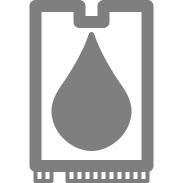 |  |  |

### SATA Drives (./icons/drives/sata/)

| `U+F220` | `U+F221` | `U+F222` | `U+F223` | `U+F224` | `U+F225` | `U+F226` | `U+F227` |
| :---: | :---: | :---: | :---: | :---: | :---: | :---: | :---: |
|  |  |  |  |  |  |  |  |

| `U+F228` | `U+F229` | `U+F22A` | `U+F22B` |
| :---: | :---: | :---: | :---: |
|  |  |  |  |

### Recycling Bin (./icons/misc/)

| `U+F0B0` | `U+F0B1` |
| :---: | :---: |
|  |  |

### Fan (./icons/misc/)

| `U+F040` | `U+F041` |
| :---: | :---: |
| 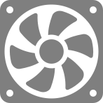 |  |

### Water Pump (./icons/misc/)

| `U+F048` |
| :---: |
|  |

### Networking (./icons/networking/)

| `U+F050` | `U+F051` | `U+F052` | `U+F053` | `U+F054` | `U+F055` | `U+F056` | `U+F057` |
| :---: | :---: | :---: | :---: | :---: | :---: | :---: | :---: |
| 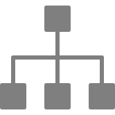 |  |  |  |  |  |  | 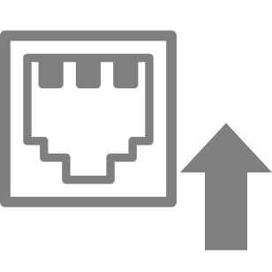 |

| `U+F058` | `U+F059` | `U+F05A` | `U+F05B` | `U+F05C` | `U+F05D` | `U+F05E` |
| :---: | :---: | :---: | :---: | :---: | :---: | :---: |
|  |  |  | 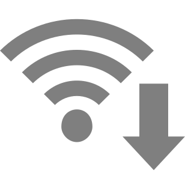 |  |  |  |

### Statistics (./icons/stats/)

| `U+F070` | `U+F071` | `U+F072` | `U+F073` | `U+F074` | `U+F075` | `U+F076` | `U+F077` |
| :---: | :---: | :---: | :---: | :---: | :---: | :---: | :---: |
|  |  |  |  | 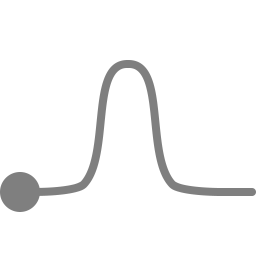 |  |  |  |

| `U+F078` |
| :---: |
|  |

### Time (./icons/stats/time)

| `U+F0D0` | `U+F0D1` | `U+F0D2` | `U+F0D3` | `U+F0D4` | `U+F0D5` | `U+F0D6` | `U+F0D7` |
| :---: | :---: | :---: | :---: | :---: | :---: | :---: | :---: |
|  |  |  |  |  |  |  |  |

| `U+F0D8` | `U+F0D9` | `U+F0DA` | `U+F0DB` | `U+F0DC` | `U+F0DD` | `U+F0DE` | `U+F0DF` |
| :---: | :---: | :---: | :---: | :---: | :---: | :---: | :---: |
|  |  |  |  |  |  |  |  |

| `U+F0E0` | `U+F0E1` | `U+F0E2` | `U+F0E3` | `U+F0E4` | `U+F0E5` | `U+F0E6` | `U+F0E7` |
| :---: | :---: | :---: | :---: | :---: | :---: | :---: | :---: |
|  |  |  |  |  |  |  | 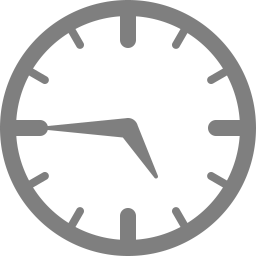 |

| `U+F0E8` | `U+F0E9` | `U+F0EA` | `U+F0EB` | `U+F0EC` | `U+F0ED` | `U+F0EE` | `U+F0EF` |
| :---: | :---: | :---: | :---: | :---: | :---: | :---: | :---: |
|  |  |  |  |  |  |  |  |

| `U+F0F0` | `U+F0F1` | `U+F0F2` | `U+F0F3` | `U+F0F4` | `U+F0F5` | `U+F0F6` | `U+F0F7` |
| :---: | :---: | :---: | :---: | :---: | :---: | :---: | :---: |
|  |  |  |  |  |  |  | 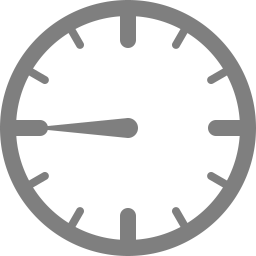 |

| `U+F0F8` | `U+F0F9` | `U+F0FA` | `U+F0FB` | `U+F0FC` | `U+F0FD` | `U+F0FE` | `U+F0FF` |
| :---: | :---: | :---: | :---: | :---: | :---: | :---: | :---: |
|  |  |  |  |  |  |  |  |

### Miscellaneous (./icons/misc/)

| `U+F060` | `U+F061` | `U+F062` | `U+F063` | `U+F064` | `U+F065` | `U+F066` | `U+F067` |
| :---: | :---: | :---: | :---: | :---: | :---: | :---: | :---: |
|  |  | 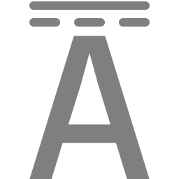 |  |  |  |  | 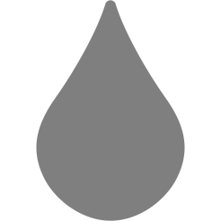 |

| `U+F068` | `U+F069` | `U+F06A` |
| :---: | :---: | :---: |
|  |  |  |

